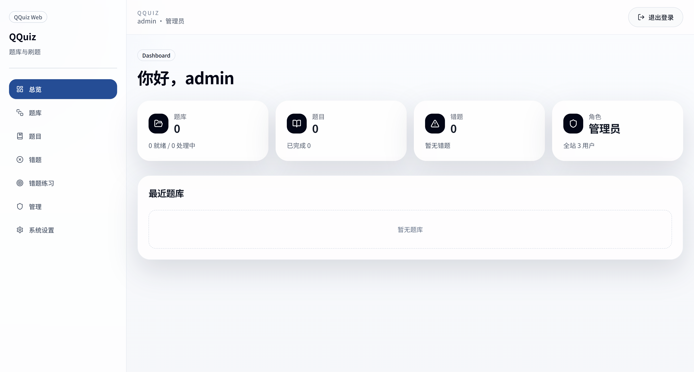

# QQuiz

QQuiz 是一个用于题库导入、刷题训练和错题管理的全栈应用，支持文档解析、题目去重、断点续做、管理员配置和多模型接入。



## 功能

- 文档导入：支持 TXT / PDF / DOC / DOCX / XLS / XLSX
- 异步解析：后台解析文档并回传进度
- 题目去重：同题库内自动去重
- 刷题与续做：记录当前进度，支持继续作答
- 错题本：自动收集错误题目
- 管理后台：用户管理、系统配置、模型配置
- AI 提供商：Gemini / OpenAI / Anthropic / Qwen

## 快速开始

QQuiz 默认以单容器形式发布和部署。GitHub Actions 只构建根目录 `Dockerfile` 生成的单容器镜像，README 也以这个路径为主。

### 方式一：直接运行 GitHub Actions 构建好的单容器镜像

适合只想快速启动，不想先克隆仓库。

#### 1. 下载环境变量模板

Linux / macOS:

```bash
curl -L https://raw.githubusercontent.com/handsomezhuzhu/QQuiz/main/.env.example -o .env
```

Windows PowerShell:

```powershell
Invoke-WebRequest `
  -Uri "https://raw.githubusercontent.com/handsomezhuzhu/QQuiz/main/.env.example" `
  -OutFile ".env"
```

#### 2. 编辑 `.env`

至少填写以下字段：

```env
SECRET_KEY=replace-with-a-random-32-char-secret
ADMIN_USERNAME=admin
ADMIN_PASSWORD=replace-with-a-strong-password

AI_PROVIDER=gemini
GEMINI_API_KEY=your-real-gemini-api-key
```

如果你不用 Gemini，也可以改成：

- `AI_PROVIDER=openai` 并填写 `OPENAI_API_KEY`
- `AI_PROVIDER=anthropic` 并填写 `ANTHROPIC_API_KEY`
- `AI_PROVIDER=qwen` 并填写 `QWEN_API_KEY`

#### 3. 拉取镜像

```bash
docker pull ghcr.io/handsomezhuzhu/qquiz:latest
```

#### 4. 创建数据卷

```bash
docker volume create qquiz_data
docker volume create qquiz_uploads
```

#### 5. 启动容器

```bash
docker run -d \
  --name qquiz \
  --env-file .env \
  -e DATABASE_URL=sqlite+aiosqlite:////app/data/qquiz.db \
  -e UPLOAD_DIR=/app/uploads \
  -v qquiz_data:/app/data \
  -v qquiz_uploads:/app/uploads \
  -p 8000:8000 \
  --restart unless-stopped \
  ghcr.io/handsomezhuzhu/qquiz:latest
```

访问：

- 应用：`http://localhost:8000`
- API 文档：`http://localhost:8000/docs`

停止：

```bash
docker rm -f qquiz
```

### 方式二：从源码启动单容器

适合需要自行构建镜像或修改代码后再部署。

```bash
cp .env.example .env
docker compose -f docker-compose-single.yml up -d --build
```

访问：

- 应用：`http://localhost:8000`
- API 文档：`http://localhost:8000/docs`

### 可选：开发或兼容性部署

以下方式保留用于开发调试或兼容场景，不再作为默认部署方案：

#### 前后端分离开发栈

```bash
cp .env.example .env
docker compose up -d --build
```

访问：

- 前端：`http://localhost:3000`
- 后端：`http://localhost:8000`

#### 分离栈叠加 MySQL

```bash
cp .env.example .env
docker compose -f docker-compose.yml -f docker-compose.mysql.yml up -d --build
```

MySQL 相关说明见 [docs/MYSQL_SETUP.md](docs/MYSQL_SETUP.md)。

## 本地开发

### 后端

```bash
cd backend
pip install -r requirements.txt
alembic upgrade head
uvicorn main:app --reload --host 0.0.0.0 --port 8000
```

### 前端

当前主前端在 `web/`：

```bash
cd web
npm install
npm run dev
```

说明：

- `web/` 是唯一前端工程，基于 Next.js
- 单容器镜像会在同一个容器里运行 FastAPI 和 Next.js，并由 FastAPI 代理前端请求

## 关键环境变量

| 变量 | 说明 |
| --- | --- |
| `DATABASE_URL` | 数据库连接字符串 |
| `SECRET_KEY` | JWT 密钥，至少 32 位 |
| `ADMIN_USERNAME` | 默认管理员用户名 |
| `ADMIN_PASSWORD` | 默认管理员密码，至少 12 位 |
| `AI_PROVIDER` | `gemini` / `openai` / `anthropic` / `qwen` |
| `GEMINI_API_KEY` | Gemini API Key |
| `OPENAI_API_KEY` | OpenAI API Key |
| `OPENAI_BASE_URL` | OpenAI 或兼容网关地址 |
| `ANTHROPIC_API_KEY` | Anthropic API Key |
| `QWEN_API_KEY` | Qwen API Key |
| `ALLOW_REGISTRATION` | 是否允许注册 |
| `MAX_UPLOAD_SIZE_MB` | 单次上传大小限制 |
| `MAX_DAILY_UPLOADS` | 每日上传次数限制 |

完整模板见 [`.env.example`](.env.example)。

## 项目结构

```text
QQuiz/
├─ backend/                   FastAPI 后端
├─ web/                       Next.js 前端工程
├─ docs/                      文档与截图
├─ test_data/                 示例题库文件
├─ docker-compose-single.yml  单容器部署（默认）
├─ Dockerfile                 单容器镜像构建（默认）
├─ docker-compose.yml         前后端分离开发/兼容部署
└─ docker-compose.mysql.yml   MySQL overlay（可选）
```

## 技术栈

- 后端：FastAPI、SQLAlchemy、Alembic、SQLite / MySQL、httpx
- 前端：Next.js 14、React 18、TypeScript、Tailwind CSS、TanStack Query

## 提交前建议检查

```bash
cd web && npm run build
docker compose -f docker-compose-single.yml build
```

建议至少手动验证：

- 登录 / 退出
- 创建题库 / 上传文档 / 查看解析进度
- 刷题 / 续做 / 错题加入
- 管理员配置
- 大数据量列表分页

## 开源协议

本项目采用 [MIT License](LICENSE)。
